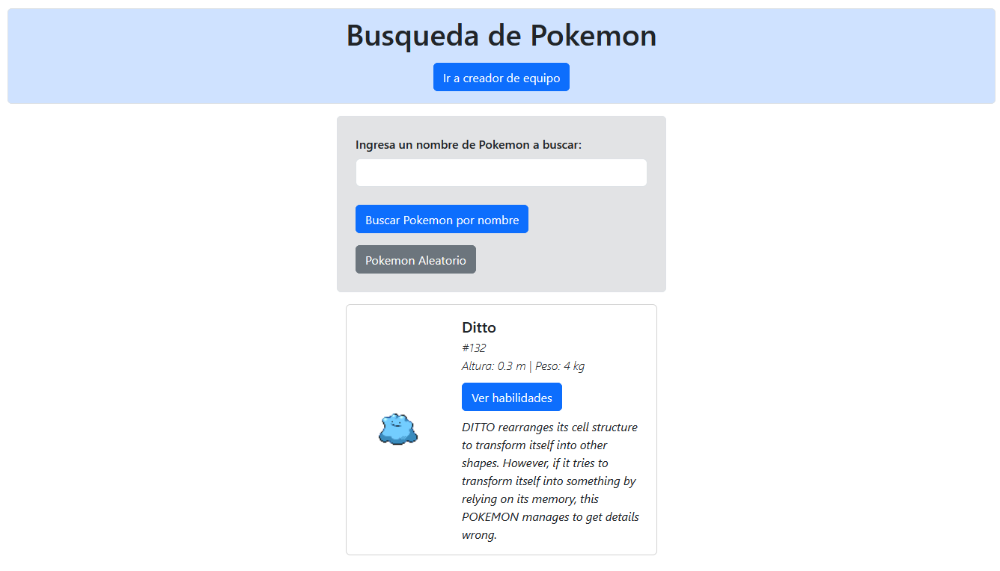
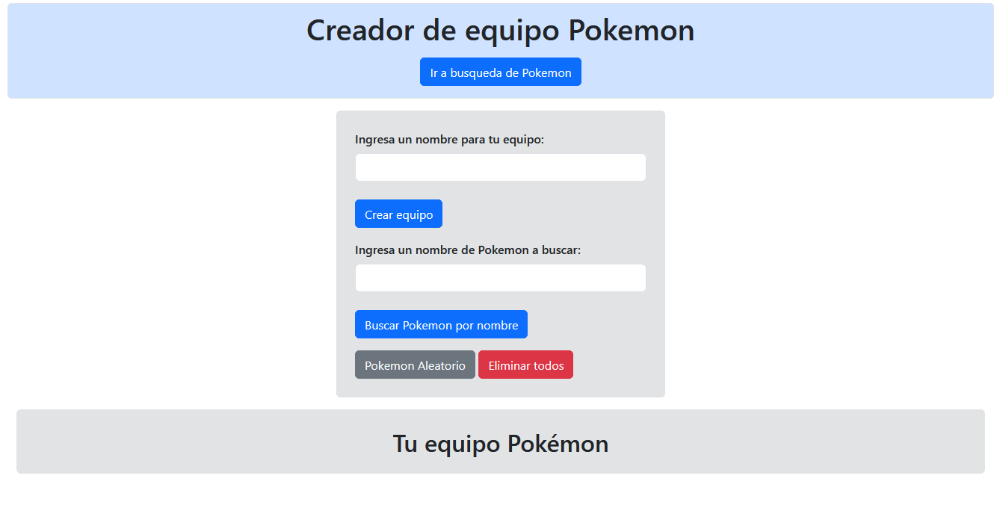

## Busqueda de Pokémones y creacion de equipo usando PokeAPI 🎨

## Descripción General 🌟

Esta es una aplicación web interactiva que te permite explorar el mundo de los Pokémon de dos maneras emocionantes:

1.  **Explorador Pokémon 🔍:** Busca tu Pokémon favorito por nombre o ID, elige un Pokémon al azar. Verás su imagen, nombre, ID, tipos, habilidades y una descripción detallada.
2.  **Constructor de Equipos 🏆:** Crea un equipo personalizado Pokemon. Dale un nombre a tu equipo y añade hasta 6 Pokémon únicos. Visualiza la información clave de cada Pokémon (imagen, nombre, ID, tipos y habilidades) y gestiona tu equipo eliminando Pokémon individualmente o vaciando el equipo completo.

## Características ✨

*   **Búsqueda Flexible:** Encuentra Pokémon por nombre, ID o de forma aleatoria.
*   **Información Detallada:** Accede a datos clave de cada Pokémon, incluyendo imagen, nombre, ID, tipos, habilidades y descripción del Pokémon.
*   **Constructor de Equipos Intuitivo:** Crea y gestiona tu equipo Pokémon con facilidad.
*   **Límite de Equipo:** Máximo 6 Pokémon por equipo.
*   **Sin Duplicados:** Evita Pokémon repetidos en tu equipo.
*   **Gestión Sencilla:** Elimina Pokémon individualmente o vacía el equipo completo con un solo clic.

## Instrucciones de Uso ⚙️

1.  **Explorador Pokémon:**
    *   Introduce el nombre o ID del Pokémon en el campo de búsqueda y presiona "Buscar".
    *   Si quieres un Pokémon aleatorio, presiona el botón "Aleatorio".
    *   Disfruta de la información detallada del Pokémon en una tarjeta.
2.  **Constructor de Equipos:**
    *   Dale un nombre a tu equipo en el campo correspondiente.
    *   Busca Pokémon y añádelos a tu equipo.
    *   Gestiona tu equipo eliminando Pokémon según sea necesario.
    *   O elimina todo el equipo si asi lo deseas.
    *   Crea tu equipo Pokémon personalizado!

## Tecnologías Utilizadas 💻

*   HTML
*   CSS
*   JavaScript
*   [PokeAPI](https://pokeapi.co/)
